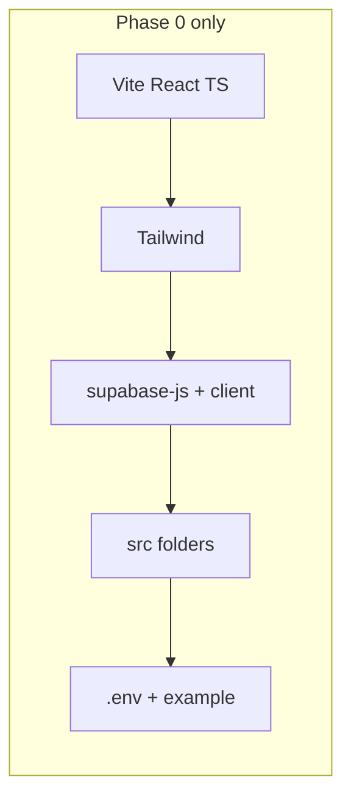

# RentLink — Phase 0: Frontend scaffold (checkpoint only)

## Scope

Everything in your list through **STEP 7** (dev tools), plus a short note on **STEP 8** (VS Code/Cursor extensions—manual). **No** database schema, pages, auth flows, or Web3Forms yet.

**Project root:** [c:\Users\Global\rentlink-frontend](c:\Users\Global\rentlink-frontend) (not inside [.cursor](c:\Users\Global\.cursor)).

## Commands and file changes (order)

### 1. Create Vite app (STEP 1)

From `c:\Users\Global`:

```bash
npm create vite@latest rentlink-frontend -- --template react-ts
cd rentlink-frontend
npm install
npm run dev
```

Using `--template react-ts` avoids interactive prompts and matches **React + TypeScript**. Confirm [http://localhost:5173](http://localhost:5173) loads.

### 2. Tailwind CSS (STEP 2)

```bash
npm install -D tailwindcss postcss autoprefixer
npx tailwindcss init -p
```

- Replace generated `tailwind.config.js` (or `.ts` if the CLI creates that) with your **content** paths for `./index.html` and `./src/**/*.{js,ts,jsx,tsx}` and `theme.extend` as you specified.
- Replace [src/index.css](c:\Users\Global\rentlink-frontend\src\index.css) with `@tailwind` directives.
- Ensure [src/main.tsx](c:\Users\Global\rentlink-frontend\src\main.tsx) still imports `./index.css`.
- Temporarily replace [src/App.tsx](c:\Users\Global\rentlink-frontend\src\App.tsx) with your Tailwind smoke test, verify styling.

**Note:** If `npx tailwindcss init` fails or the project pulls **Tailwind v4**, the config differs from your snippet. In that case, either pin **Tailwind v3** (`tailwindcss@3`) for a hackathon-stable match to your instructions, or adjust to v4’s CSS-first setup—choose one path and stick to it before moving on.

### 3. Supabase client package (STEP 3)

```bash
npm install @supabase/supabase-js
```

### 4. Folder structure (STEP 4)

Under `src/`, add empty dirs (or placeholder `.gitkeep` if you want them tracked): `components`, `pages`, `services`, `hooks`, `context`, `utils`.

### 5. Supabase client module (STEP 5)

Create [src/services/supabaseClient.ts](c:\Users\Global\rentlink-frontend\src\services\supabaseClient.ts):

- `createClient` with `import.meta.env.VITE_SUPABASE_URL` and `import.meta.env.VITE_SUPABASE_ANON_KEY` typed as `string`.
- Optional guard: if vars are missing in dev, log a clear warning so the app doesn’t fail silently.

### 6. Environment variables (STEP 6)

Create [.env](c:\Users\Global\rentlink-frontend\.env) (local secrets) with placeholders:

- `VITE_SUPABASE_URL=`
- `VITE_SUPABASE_ANON_KEY=`

Add [.env.example](c:\Users\Global\rentlink-frontend\.env.example) with the same keys and dummy values so collaborators know what to set. Ensure [.gitignore](c:\Users\Global\rentlink-frontend\.gitignore) includes `.env` (Vite template usually does).

### 7. Dev tools (STEP 7)

```bash
npm install -D prettier eslint
```

Minimal **Prettier** config (e.g. `.prettierrc` with semi/format defaults) is enough for the checkpoint; full **ESLint** + TypeScript rules can wait until the next task unless you want a one-line `eslint .` script now.

### 8. Extensions (STEP 8)

Manual in Cursor/VS Code: Tailwind IntelliSense, Prettier, ESLint, Auto Rename Tag, Path Intellisense—no repo changes required.

## Checkpoint verification

| Check | Action |
|--------|--------|
| React app runs | `npm run dev`, open 5173 |
| Tailwind works | Blue test screen from your `App.tsx` |
| Folders exist | `src/components`, `pages`, `services`, `hooks`, `context`, `utils` |
| Supabase file | `src/services/supabaseClient.ts` exports `supabase` |
| Env | `.env` present with `VITE_*` keys (values filled when you have a Supabase project) |

## After this phase (do not implement until you say so)

Next instructions from you would cover: Supabase SQL for users/items/bookings/reviews, RLS, verification states (**pending / approved / rejected**), homepage search + category dropdown, booking/deposit/countdown logic, Web3Forms at 25% remaining time, and M-Pesa simulation—aligned with your RentLink spec.


